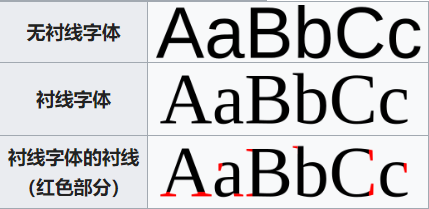

# 等宽字体与比例字体
等宽字体（Monospaced）是指字符宽度相同的电脑字体，与此相对，字符宽度不尽相同的电脑字体称为比例字体（Proportional）。一图胜千言

对于中文字体而言，一般认为它们都是等宽的
Windows 中常用的等宽字体为 Consolas；macOS 中常用的等宽字体为 Menlo；Linux 中常用的等宽字体为 Mono。
# 衬线字体与非衬线字体
衬线体（Serif）和无衬线体（Sans-Serif）的区别就在于有无衬线，而衬线则指的是字形笔画末端的装饰细节部分。一图胜千言

对于简体中文字体而言，习惯性称衬线字体为宋体，非衬线字体为黑体

衬线字体常用于印刷业
 Word 文档时，常用的英文衬线字体就是 Times New Roman；而在做 PPT 时，个人倾向于使用非衬线字体微软雅黑
 ## 编程字体
 写代码应该使用的字体对于衬线或非衬线要求不大，但强烈建议使用等宽字体，这样可以便于代码对齐
 还应该对特殊字符有较高的辨识度，比如 I（大写 i）、l（小写 L）、1（数字 1），0（数字 0）、O（大写 o） 等。最后，中文字符的宽度应该严格是英文字符宽度的 2 倍，在某些时候，你会发现这很有用。
 be5invis 开发的 Sarasa-Gothic（更纱黑体） 系列字体，它的前身便是 Inziu Iosevka 系列字体，现在已经迁移至 Sarasa-Gothic，推荐使用其中的 Sarasa Term SC 型字体。此外，这一系列字体都是开源免费的。
 # 术语
在下载某些字体时，可能会遇到相关术语，如下：

mono：即 Monospaced，等宽字体
sans：即 Sans-Serif，无衬线体
gothic：哥特体，即无衬线体
bold：粗体
italic：斜体
bolditalic：加粗斜体
regular：常规体
sc：即 Simplified Chinese，简体中文
tc：即 Traditional Chinese，繁体中文
cl：即 Classical Literature，《康熙字典》字形
j：即 Japanese，日文
ligature：连体字符，举例来说，会把 != 变成 ≠

配色
关于代码配色，就真是个“仁者见仁，智者见智”的问题了，个人要求满足以下两点：

采用黑色背景
官网提供多种编辑器的支持
综上，个人倾向于使用 Dracula 
参考 https://www.cnblogs.com/yongdaimi/p/15826975.html

参考https://github.com/be5invis/Sarasa-Gothic
更纱黑体是一种中文编程字体，支持在中文Windows系统的命令行窗口中使用。
包含样式：
    Sarasa Gothic / 更纱黑体：基于Inter，全宽引号
    Sarasa UI / 更纱黑体 UI：基于Inter，窄引号

# 知乎推荐

经反复在三台不同dpi的显示器上试验（2019.11.21更新）小字组：OppoSans最佳，冬青上佳、苹方次佳、旗黑再次、方正兰亭刊黑、兰亭黑Pro殿后，其他无视；中字组：冬青最佳、旗黑次佳、方正兰亭黑Pro、雅黑Light尚可（6.20、11.30）；大字组：苹方、阿里普惠、方正悠黑，都没有达到上佳，只能算次佳。思源黑在各组表现都只能说刚刚爬上及格线。另外特别推荐方正悠宋，这个看上去效果跟黑体类似。

链接：https://www.zhihu.com/question/21355733/answer/830413320
https://fonts.alibabagroup.com/#/home
